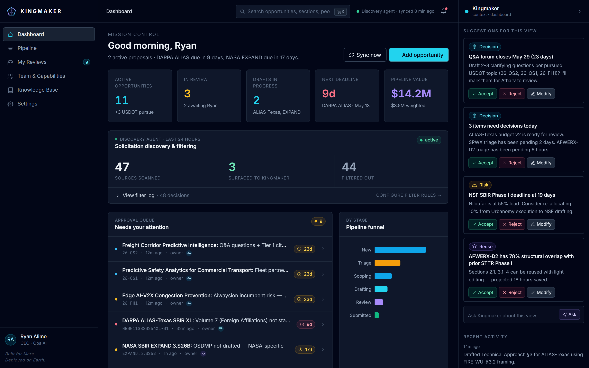
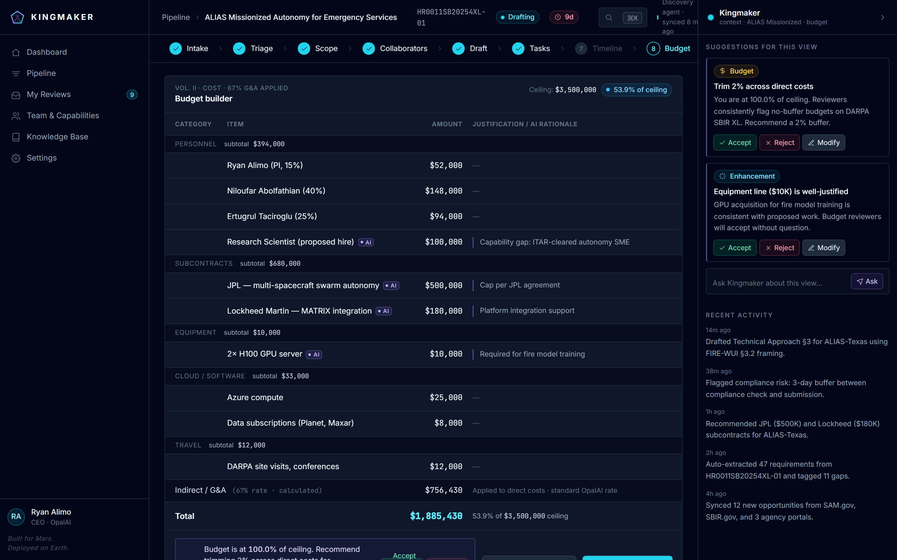
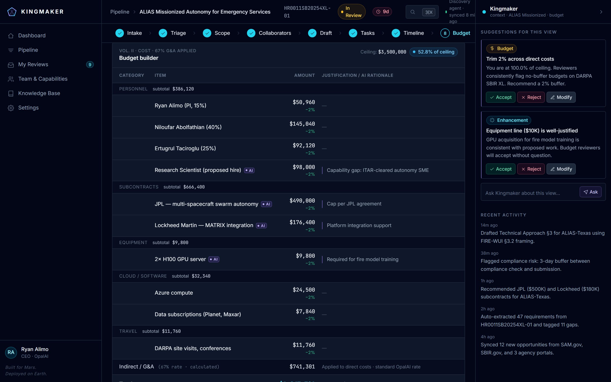
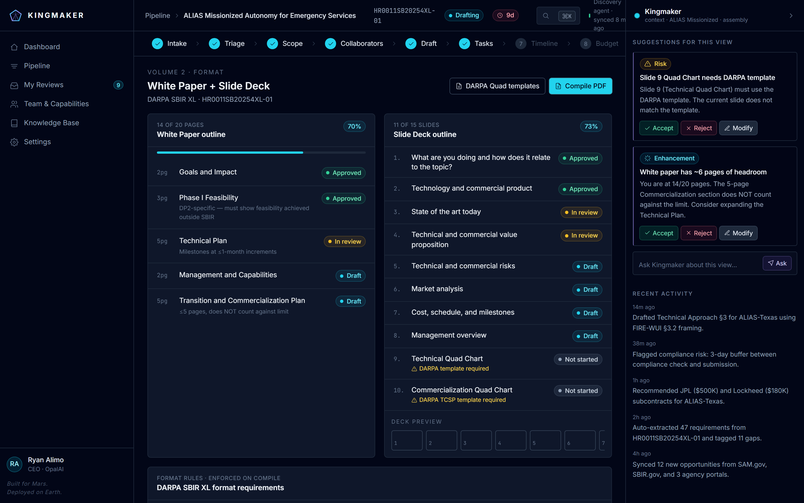
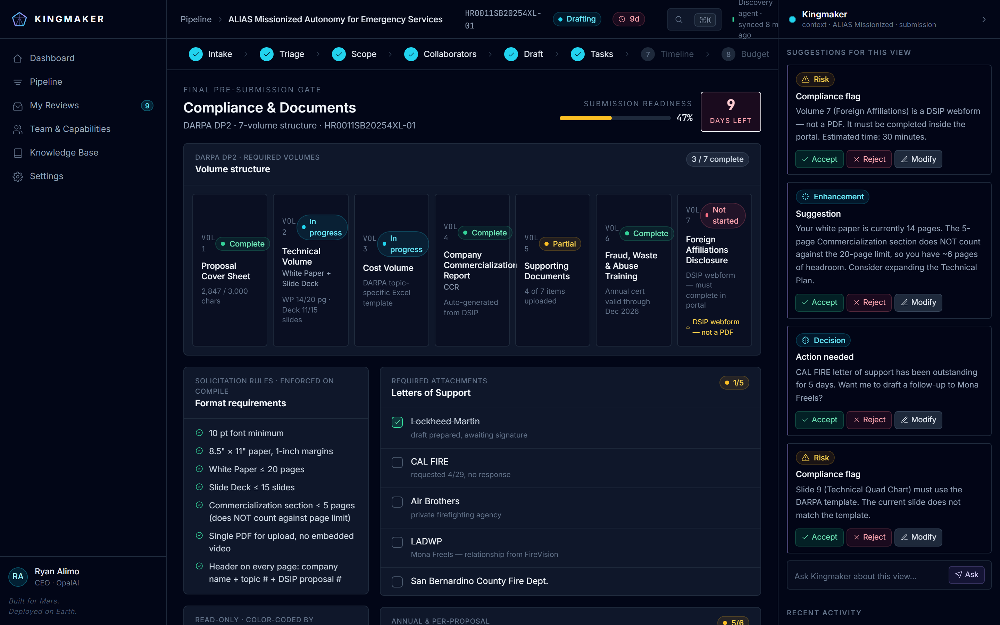
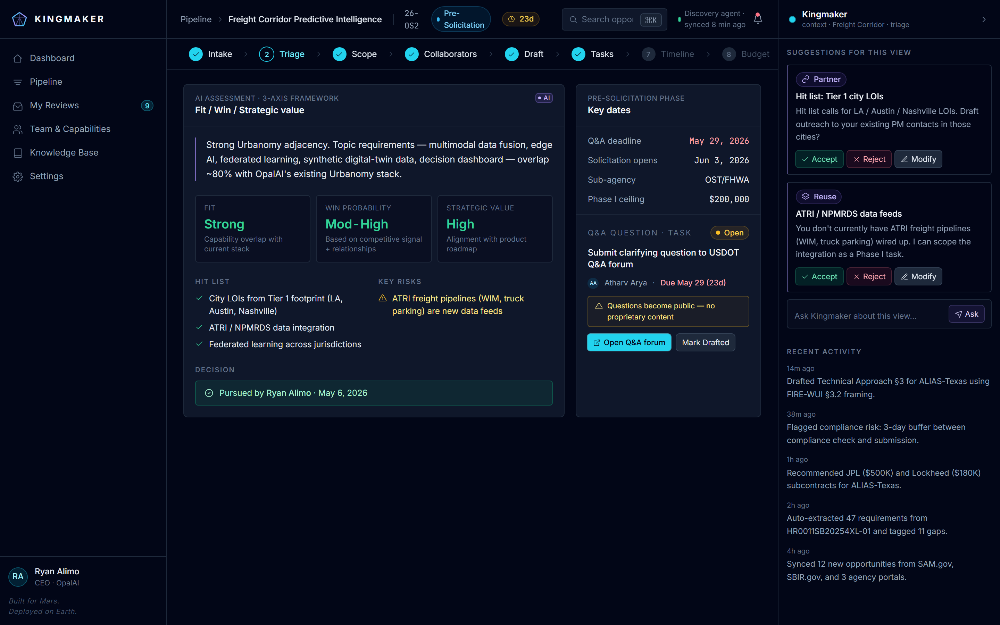
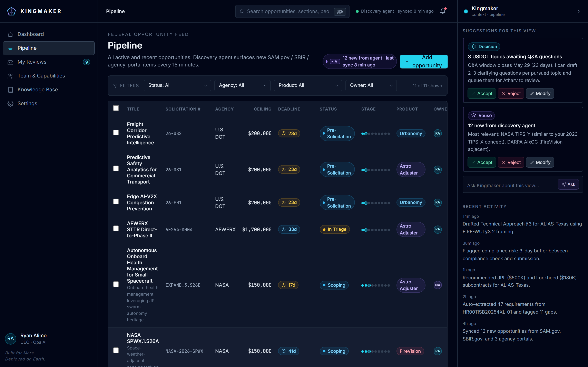

# Kingmaker

> Agency-cycle-aware proposal operations for federal R&D teams.

[](https://vitejs.dev/)
[](https://react.dev/)
[](https://tailwindcss.com/)
[](https://web.dev/progressive-web-apps/)
[](#license)



---

## Who this is for

Kingmaker is built for **small federal R&D primes** — the SBIR / STTR / OT-eligible
shops chasing DARPA, NASA, AFWERX, USDOT, NSF, and DOE awards. The reference
persona is **OpalAI**: a 9-person team running two live proposals (DARPA
ALIAS-Texas, NASA SBIR EXPAND) plus a pre-solicitation cohort across USDOT
FY26 — with a 9-day deadline on the line.

Today these teams live in spreadsheets, Drive folders, Slack threads, and a
PI's head. Proposal ops is *agency-cycle-aware* work — DARPA's DSIP, NASA's
NSPIRES, USDOT's pre-solicitation Q&A windows are all different products
with different rules — and that nuance falls out of every generic PM tool.

## The problem in one sentence

A 4-week federal proposal response is won or lost on **format compliance,
team allocation, and partner coordination** — and the cost of getting any
of those wrong on submission day is the entire ceiling. Kingmaker is the
operating layer that keeps those plates spinning.

## What Kingmaker does

A workspace that ingests opportunities from a discovery agent, runs each
one through a 10-step workflow tailored to the agency's actual submission
format, and surfaces the next decision the team needs to make — with an AI
right-rail that is *screen-aware*, not a generic chat box.

---

## Features (the demo path)

The product is designed to be walked through in roughly five minutes.

> 🎥 **14-second walkthrough of the dashboard + discovery-agent filter log:**

<video src="https://github.com/abdatta/kingmaker/raw/main/media/01-dashboard-discovery-agent.mp4" controls width="100%" muted playsinline>
  Your browser doesn't support inline video.
  Watch <a href="media/01-dashboard-discovery-agent.mp4">the MP4</a>
  or the <a href="media/01-dashboard-discovery-agent.webm">WebM</a> directly.
</video>

<sup>(If the player doesn't render inline, open
[`media/01-dashboard-discovery-agent.mp4`](media/01-dashboard-discovery-agent.mp4)
or the [`.webm`](media/01-dashboard-discovery-agent.webm) directly.)</sup>

### 1. Dashboard — what needs your attention right now


The landing surface combines four signals: **KPI strip** (active count,
next deadline, pipeline value), the **Discovery Agent panel** ("47 scanned
/ 3 surfaced / 44 filtered — view filter log" — *transparency about the
agent's rejections, not just its hits*), the **approval queue** with
deadline-proximity color coding, and a per-funnel-stage chart.

### 2. Discovery Agent — what was filtered out, and why

The agent doesn't just surface opportunities — it shows its work. Click
**View filter log** to expand the recent decisions: *USDOT 26-FR1 → Rail
power electronics, outside domain; DOD SBIR AF254-D012 → ITAR-restricted
facility OpalAI does not meet.* Sells the agent as a trust-building tool,
not a black box.

### 3. The 10-step opportunity workspace

Open any opportunity and you land in a step nav covering the full
cycle — **Intake → Triage → Scope → Collaborators → Draft → Tasks →
Timeline → Budget → Assembly → Compliance**.

The "demo moment" is on **Step 7 (Budget)**: the right rail flags that
the budget is at 100% of ceiling and recommends a 2% buffer. Click
**Accept**:

| Before                                            | After                                                        |
| ------------------------------------------------- | ------------------------------------------------------------ |
|  |  |

Every line reflows with `-2%` annotations, an emerald confirmation banner
replaces the AI suggestion, **and the opportunity's status pill in the
TopBar flips Drafting → In Review** in lockstep — one click, three
downstream effects, no modal.

### 4. Format-aware Assembly (Step 9)



DARPA SBIR XL ships as a **White Paper + 15-slide Deck** with two mandatory
DARPA-template Quad Charts. Switch to NASA SBIR EXPAND and the same step
re-renders as a standard 10-section Technical Volume with a 5-page hard
limit. Same product, different agency, different volume structure — the
workspace adapts instead of forcing a generic outline.

### 5. Format-aware Compliance & Documents (Step 10)



The pre-submission gate. Volume strip across the top reflects the
agency's actual structure (DARPA's 7-volume DSIP, with **Volume 7 flagged
as a DSIP webform — not a PDF**). Solicitation format rules on the left,
required attachments (Letters of Support, Registration & Admin,
Pre-Submission gates) on the right, with live checkboxes driving the
readiness gauge. The **Mark Ready for Submission** button stays disabled
until every gate clears.

### 6. Pre-Solicitation triage — 3-axis decision framework



Kingmaker recognizes phases the rest of the market collapses into "new
lead." For the three pursued USDOT FY26 topics (`26-OS2`, `26-OS1`,
`26-FH1`), Triage renders OpalAI's actual **Fit / Win Probability /
Strategic Value** framework, the hit list, key risks, and the decision
stamp. The right column carries the cycle-specific task type — **Q&A
Question**, owner Atharv Arya, May 29 deadline (23 days), with a
public-content warning since questions become public on the agency
forum.

### 7. Pipeline — every opportunity in one view



12 rows across 6 agencies, with **Pre-Solicitation** as a first-class
status (between *New* and *In Triage*). Filter by status, agency,
product line, owner. Multi-select for bulk pursue/reject. The right
rail surfaces "3 USDOT topics awaiting Q&A questions — window closes May 29"
without you having to ask.

### Cross-cutting: the screen-aware AI rail

Every screen ships its own suggestion set — **Budget** gets the trim
recommendation, **Compliance** gets DSIP webform warnings and CAL FIRE
letter follow-up nudges, **Team** flags the bottleneck, **Pipeline**
flags unassigned items. Every card has **Accept / Reject / Modify**.
There is no always-on chatbot; suggestions are discrete decisions tied
to context.

---

## Demo script (≈5 minutes)

1. Land on **Dashboard**, expand the Discovery Agent filter log
2. Click *"DARPA ALIAS-Texas: Budget v2 ready for review"* in **Needs Your Attention**
3. On **Step 7 (Budget)**, click **Accept · trim 2%** — watch the reflow + status flip
4. Click **Step 9 (Assembly)** — point out the White Paper + Deck split
5. Click **Step 10 (Compliance)** — point out Volume 7 (DSIP webform, not PDF)
6. Navigate to **Pipeline**, click a USDOT FY26 row — show the 3-axis Pre-Sol triage and Q&A task

The **Tweaks panel** (`⚙️` corner, bottom-right) has *Reset demo state* and
*Jump to Dashboard* buttons for running the script twice.

---

## Try it locally

```bash
npm install
npm run dev          # http://localhost:5173
```

Other scripts:

```bash
npm run build                # production build → dist/
npm run preview              # serve dist/ on :4173
npm run generate-pwa-assets  # regenerate PWA icons from public/favicon.svg
node scripts/screenshots.mjs # regenerate README screenshots (dev server must be running)
node scripts/record-demo.mjs # regenerate the dashboard walkthrough video (needs ffmpeg for .mp4)
```

---

## Developer notes

### Stack

| Layer       | Choice                                             |
| ----------- | -------------------------------------------------- |
| Build       | **Vite 5** (`@vitejs/plugin-react`)                |
| UI          | **React 18** + **Tailwind CSS 3**                  |
| Routing     | **React Router 6** (`BrowserRouter`)               |
| Charts      | **Recharts** (pipeline funnel)                     |
| PWA         | **vite-plugin-pwa** (autoUpdate + Workbox)         |
| Screenshots | **Playwright** (dev-only, via `scripts/`)          |

### Routes

| Path                | Screen                                |
| ------------------- | ------------------------------------- |
| `/`                 | Dashboard                             |
| `/pipeline`         | Pipeline / opportunity feed           |
| `/reviews`          | My Reviews — approval queue           |
| `/team`             | Team & Capabilities                   |
| `/kb`               | Knowledge Base                        |
| `/settings`         | Settings (org, CAGE/UEI, source feeds)|
| `/opp/:oppId`       | Redirects to `/opp/:oppId/budget`     |
| `/opp/:oppId/:step` | Workspace at the given step           |

Workspace steps: `intake`, `triage`, `scope`, `collaborators`, `draft`,
`tasks`, `timeline`, `budget`, `assembly`, `submission`.

### Project layout

```
src/
  main.jsx           entry — registers SW, mounts <App/> in <BrowserRouter>
  App.jsx            top-level layout + workspace state + <Routes>
  error-boundary.jsx route-level error boundary (auto-resets on URL change)
  index.css          tailwind layers + custom keyframes
  data.js            static fixture data (opportunities, team, formats…)
  icons.jsx          inline SVG icon set (lucide-flavored)
  primitives.jsx     Pill, Avatar, Card, Button, Mono, ProgressBar…
  shell.jsx          Sidebar, TopBar, AIRail
  dashboard.jsx      Dashboard + Discovery Agent panel
  pipeline.jsx       Pipeline table + bulk actions
  workspace.jsx      Step panels: intake → timeline
  other-screens.jsx  Budget / Assembly / Compliance / Team / KB / Reviews / Settings
  tweaks-panel.jsx   floating tweaks panel + hooks

public/              favicon + generated PWA icons
scripts/             dev tooling (Playwright screenshot script)
screenshots/         README assets (regenerated by scripts/screenshots.mjs)
.github/workflows/   GitHub Pages deploy
```

### PWA

`vite-plugin-pwa` (autoUpdate) precaches the built bundle and runtime-caches
Google Fonts. The app installs from any modern browser via the address-bar
install button. The manifest's `start_url` / `scope` and the Vite `base` are
all driven by `VITE_BASE` so the same build works at the root *or* under a
sub-path.

### Deployment — GitHub Pages

`.github/workflows/deploy.yml` builds on every push to `main` and publishes
`dist/` via the official `actions/deploy-pages` flow.

One-time repo setup: in **Settings → Pages**, set **Source = GitHub
Actions**. Then push to `main`. The site lands at
`https://<user>.github.io/<repo>/`.

The workflow injects `VITE_BASE=/<repo>/` so all asset paths, the React
Router `basename`, and the PWA manifest's `start_url`/`scope` line up under
the sub-path. It also writes `dist/404.html` (a copy of `index.html`) so
deep links like `/opp/alias-tx/budget` survive hard refreshes — GitHub
Pages serves `404.html` for unknown paths and the SPA router takes over
from there. `.nojekyll` is dropped to skip Jekyll.

Other deploy targets:

- **User/org root site** or **custom domain**: override `VITE_BASE: /` in
  the workflow before the build step.
- **Local preview of the production build**: `npm run preview`.

### Notes

- The app is designed for ≥1440px desktop; narrower viewports compress
  columns but everything still renders.
- All proposal/team data is static fixture content — there is no backend.
  Mutations (budget trim, checklist ticks) live in React state and reset
  on reload.
- The Tweaks panel sends `postMessage` events to `window.parent`; these
  are harmless when running standalone.

## License

MIT
